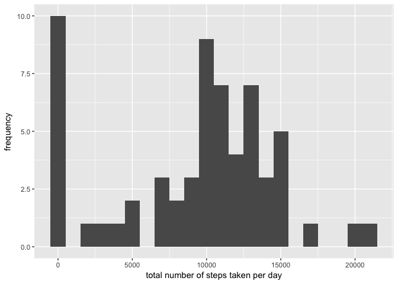
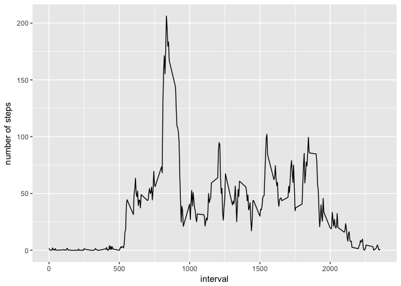
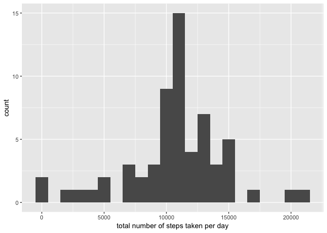

# Reproducible Research: Peer Assessment 1


## Loading and preprocessing the data


```r
unzip(zipfile="activity.zip")
data <- read.csv("activity.csv")

## What is mean total number of steps taken per day?

library(ggplot2)
total_steps <- tapply(data$steps, data$date,sum,na.rm=TRUE)
qplot(total_steps, binwidth=1000, xlab="total number of steps taken per day", ylab="frequency")
```

<!-- -->

```r
mean(total_steps)
```

```
## [1] 9354.23
```

```r
median(total_steps)
```

```
## [1] 10395
```

```r
## What is the average daily activity pattern?
average_steps <- aggregate(x=list(steps=data$steps),by=list(interval=data$interval),mean, na.rm=TRUE)
ggplot(data=average_steps, aes(x=interval, y=steps)) + geom_line() + xlab("interval") + ylab("number of steps")
```

<!-- -->

```r
maximum_steps <- average_steps[which.max(average_steps$steps),]
maximum_steps 
```

```
##     interval    steps
## 104      835 206.1698
```

```r
## Imputing missing values

table(is.na(data$steps))
```

```
## 
## FALSE  TRUE 
## 15264  2304
```

```r
fill_value <- function(steps, interval) {
  filled <- NA
  if (!is.na(steps))
    filled <- c(steps)
  else
    filled <- (average_steps[average_steps$interval==interval, "steps"])
  return(filled)
}
filled_data <- data
filled_data$steps <- mapply(fill_value, filled_data$steps, filled_data$interval)
table(is.na(filled_data$steps))
```

```
## 
## FALSE 
## 17568
```

```r
total_steps <- tapply(filled_data$steps, filled_data$date, sum)
qplot(total_steps, binwidth=1000, xlab="total number of steps taken per day")
```

<!-- -->

```r
mean(total_steps)
```

```
## [1] 10766.19
```

```r
median(total_steps)
```

```
## [1] 10766.19
```

```r
## Are there differences in activity patterns between weekdays and weekends?
weekday_or_weekend <- function(which_date) {
  day <- weekdays(which_date)
  if (day %in% c("Monday", "Tuesday", "Wednesday", "Thursday", "Friday"))
    return("weekday")
  else if (day %in% c("Saturday", "Sunday"))
    return("weekend")
  else
    stop("invalid date")
}
filled_data$date <- as.Date(filled_data$date)
filled_data$day <- sapply(filled_data$date,weekday_or_weekend)

average_steps <- aggregate(steps ~ interval + day, data=filled_data, mean)
ggplot(average_steps, aes(interval, steps)) + geom_line() + facet_grid(day ~ .) +
  xlab("5-minute interval") + ylab("Number of steps")
```

<!-- -->
